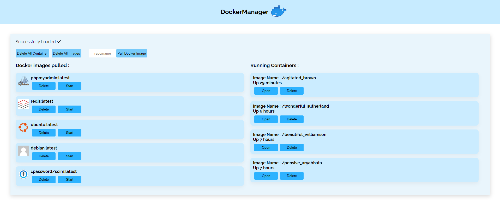

# Go-DockerManager
#### Easily manage your docker containers
##### ✅ Linux Support
##### ❌ Windows Support

## Docker on the Web !

### Your container on the Web

#### If you want to run the terminal on a domain, just go to env/env.go and change this line ⬇

#### part of personal projects
#### allowed during work time [datamixio](https://datamix.io)
